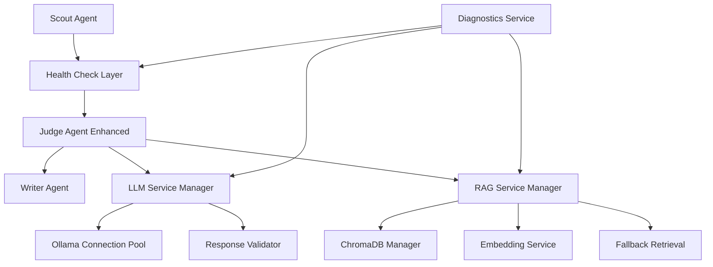

# Design Document: Brand Mention Analysis System Fix

## Overview

This design addresses the critical failures in the existing brand mention analysis system by implementing robust error handling, reliable RAG integration, and improved LLM connectivity. The solution maintains the existing Scout → Judge → Writer pipeline while adding resilience, diagnostics, and fallback mechanisms.

The core issues identified are:
1. Judge agent fails due to LLM connectivity or parsing errors
2. RAG system lacks proper error handling and validation
3. No diagnostic capabilities for troubleshooting
4. Missing fallback mechanisms for component failures

## Architecture

The enhanced system maintains the existing LangGraph-based multi-agent architecture but adds several reliability layers:



## Components and Interfaces

### Enhanced Judge Agent

The Judge agent will be redesigned with multiple reliability layers:

**Core Interface:**
```python
class EnhancedJudgeAgent:
    def analyze_mention(self, text: str, brand_context: str = None) -> AnalysisResult
    def health_check(self) -> HealthStatus
    def get_diagnostics(self) -> DiagnosticsReport
```

**Analysis Result Structure:**
```python
class AnalysisResult:
    sentiment: str
    intent: str
    urgency_score: int
    summary: str
    confidence_scores: Dict[str, float]
    reasoning: str
    error_info: Optional[ErrorInfo]
    fallback_used: bool
```

### LLM Service Manager

Handles all LLM interactions with connection pooling and retry logic:

**Interface:**
```python
class LLMServiceManager:
    def __init__(self, model: str, max_retries: int = 3)
    def invoke_with_retry(self, prompt: str) -> LLMResponse
    def validate_response(self, response: str, schema: Type[BaseModel]) -> BaseModel
    def is_healthy(self) -> bool
```

**Connection Management:**
- Connection pooling with health checks
- Exponential backoff retry strategy (1s, 2s, 4s delays)
- Circuit breaker pattern for persistent failures
- Response validation against Pydantic schemas

### RAG Service Manager

Enhanced RAG system with validation and fallbacks:

**Interface:**
```python
class RAGServiceManager:
    def __init__(self, db_dir: str, embedding_model: str)
    def get_brand_context(self, query: str) -> RAGResult
    def validate_vector_store(self) -> ValidationResult
    def reingest_guidelines(self, pdf_path: str) -> bool
    def fallback_retrieval(self, query: str) -> str
```

**Features:**
- Vector store validation on startup
- Automatic re-ingestion detection
- Keyword-based fallback when embeddings fail
- Context relevance scoring

### Diagnostics Service

Comprehensive system health monitoring:

**Interface:**
```python
class DiagnosticsService:
    def run_full_diagnostics(self) -> DiagnosticsReport
    def check_ollama_connectivity(self) -> ComponentStatus
    def check_vector_store_health(self) -> ComponentStatus
    def check_embedding_service(self) -> ComponentStatus
    def get_performance_metrics(self) -> PerformanceMetrics
```

## Data Models

### Enhanced Analysis Schema

```python
class Analysis(BaseModel):
    sentiment: Literal["Positive", "Negative", "Neutral", "Unknown"]
    intent: Literal["Complaint", "Compliment", "Inquiry", "Error"]
    urgency_score: int = Field(ge=0, le=10)
    summary: str
    confidence_scores: Dict[str, float] = Field(default_factory=dict)
    reasoning: str = ""
    guidelines_used: List[str] = Field(default_factory=list)
    processing_time_ms: int = 0
    fallback_used: bool = False
```

### Error Information Schema

```python
class ErrorInfo(BaseModel):
    error_type: Literal["LLM_CONNECTION", "RAG_FAILURE", "PARSING_ERROR", "VALIDATION_ERROR"]
    error_message: str
    component: str
    timestamp: datetime
    retry_count: int = 0
```

### Health Status Schema

```python
class HealthStatus(BaseModel):
    overall_status: Literal["HEALTHY", "DEGRADED", "FAILED"]
    components: Dict[str, ComponentStatus]
    last_check: datetime
    
class ComponentStatus(BaseModel):
    name: str
    status: Literal["UP", "DOWN", "DEGRADED"]
    response_time_ms: int
    error_message: Optional[str] = None
```

## Correctness Properties

*A property is a characteristic or behavior that should hold true across all valid executions of a system-essentially, a formal statement about what the system should do. Properties serve as the bridge between human-readable specifications and machine-verifiable correctness guarantees.*

<function_calls>
<invoke name="prework">
<parameter name="featureName">brand-mention-analysis-fix

Based on the prework analysis, I'll now convert the testable acceptance criteria into correctness properties:

**Property Reflection:**
After reviewing all properties identified in the prework, I found several areas where properties can be consolidated:
- Properties 1.1, 1.2, 1.3 can be combined into a comprehensive LLM connection handling property
- Properties 2.1, 2.2, 2.3, 2.4 can be consolidated into RAG system reliability properties
- Properties 3.1, 3.2 can be combined into comprehensive error handling
- Properties 4.1, 4.3, 4.5 can be consolidated into analysis quality properties

### Core System Properties

**Property 1: LLM Connection Resilience**
*For any* brand mention analysis request, the system should verify Ollama connectivity, retry with exponential backoff (1s, 2s, 4s) up to 3 attempts on failure, and return structured fallback responses when all attempts fail
**Validates: Requirements 1.1, 1.2, 1.3**

**Property 2: Response Validation and Parsing**
*For any* LLM response, the system should validate against the Analysis schema and gracefully handle malformed JSON by attempting partial parsing or returning structured error responses
**Validates: Requirements 1.4, 1.5**

**Property 3: RAG System Reliability**
*For any* brand guidelines query, the RAG system should return relevant context within 5 seconds, detect empty/corrupted vector stores, and fallback to keyword-based retrieval when embeddings fail
**Validates: Requirements 2.1, 2.2, 2.3, 2.4**

**Property 4: Automatic Re-ingestion**
*For any* brand guidelines update, the system should automatically detect changes and re-ingest the updated content into the vector store
**Validates: Requirements 2.5**

**Property 5: Comprehensive Error Handling**
*For any* agent failure, the system should log detailed error information with stack traces and provide specific failure categorization (LLM, RAG, parsing, etc.)
**Validates: Requirements 3.1, 3.2**

**Property 6: Independent Component Diagnostics**
*For any* diagnostic request, the system should test each component (Ollama, ChromaDB, Vector_Store) independently and report individual status
**Validates: Requirements 3.4**

**Property 7: Analysis Quality with Context**
*For any* brand mention analysis, the Judge agent should include relevant brand guidelines context in prompts, provide confidence scores for all classifications, and include reasoning based on guidelines
**Validates: Requirements 4.1, 4.3, 4.5**

**Property 8: Ambiguous Sentiment Handling**
*For any* sentiment analysis with confidence below 70%, the system should request human review rather than providing uncertain classifications
**Validates: Requirements 4.2**

**Property 9: High Urgency Flagging**
*For any* analysis with urgency score above 7, the system should automatically flag for immediate human attention
**Validates: Requirements 4.4**

**Property 10: Graceful Degradation**
*For any* component failure scenario, the system should continue processing with appropriate fallbacks rather than crashing, including Judge agent fallbacks and Writer agent resilience with incomplete data
**Validates: Requirements 5.1, 5.2, 5.4, 5.5**

**Property 11: Batch Processing Resilience**
*For any* batch of brand mentions, the system should continue processing subsequent mentions even when individual mention analysis fails
**Validates: Requirements 5.3**

**Property 12: Performance Monitoring and Alerting**
*For any* system performance degradation, monitoring should alert administrators within 1 minute and automatically switch to fallback modes when error rates exceed 10%
**Validates: Requirements 6.2, 6.4**

**Property 13: Metrics Collection**
*For any* system operation, the system should track success rates for each agent, overall pipeline performance, analysis accuracy, and response times
**Validates: Requirements 6.3, 6.5**

## Error Handling

The system implements a multi-layered error handling strategy:

### Error Categories
1. **LLM_CONNECTION**: Ollama service unavailable or timeout
2. **RAG_FAILURE**: Vector store corruption or embedding service failure
3. **PARSING_ERROR**: Malformed JSON or schema validation failure
4. **VALIDATION_ERROR**: Input validation or business rule violations

### Fallback Hierarchy
1. **Primary**: Full analysis with LLM + RAG
2. **Degraded**: LLM analysis without RAG context
3. **Minimal**: Rule-based analysis with predefined responses
4. **Emergency**: Structured error response with human escalation

### Circuit Breaker Pattern
- Open circuit after 5 consecutive failures
- Half-open state after 30-second cooldown
- Close circuit after 3 successful requests

## Testing Strategy

The testing approach combines unit tests for specific scenarios with property-based tests for comprehensive coverage:

### Unit Testing Focus
- Specific error scenarios and edge cases
- Integration points between components
- Configuration validation
- Health check endpoint responses

### Property-Based Testing Configuration
- **Framework**: Hypothesis for Python
- **Iterations**: Minimum 100 per property test
- **Test Tags**: Each test references design property number
- **Tag Format**: `# Feature: brand-mention-analysis-fix, Property {N}: {property_text}`

### Test Data Generation
- **Brand Mentions**: Generate realistic social media posts, reviews, comments
- **Malformed Responses**: Generate various JSON parsing edge cases
- **Network Conditions**: Simulate connection failures, timeouts, partial responses
- **Vector Store States**: Generate empty, corrupted, and valid store conditions

### Performance Testing
- Load testing with concurrent mention processing
- Stress testing component failure scenarios
- Latency testing for RAG query response times
- Memory usage monitoring during batch processing

The dual testing approach ensures both concrete bug detection through unit tests and universal correctness verification through property-based testing, providing comprehensive coverage of the enhanced brand mention analysis system.